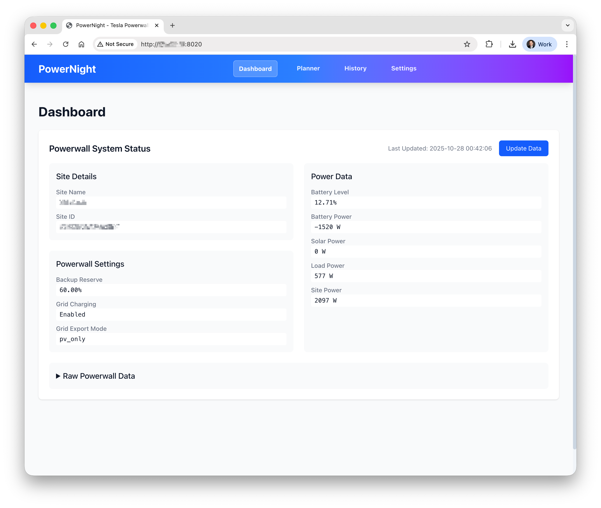
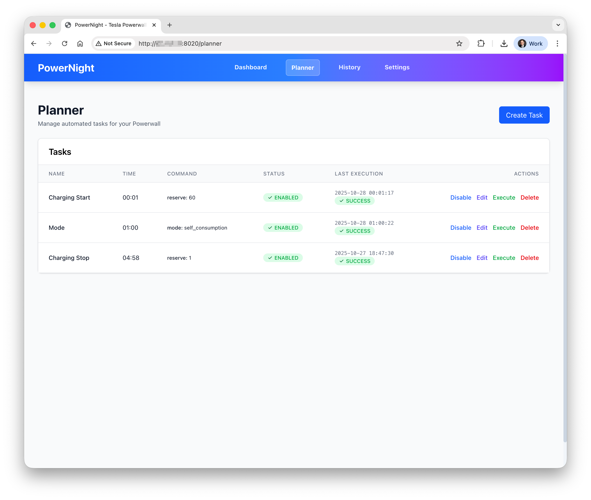
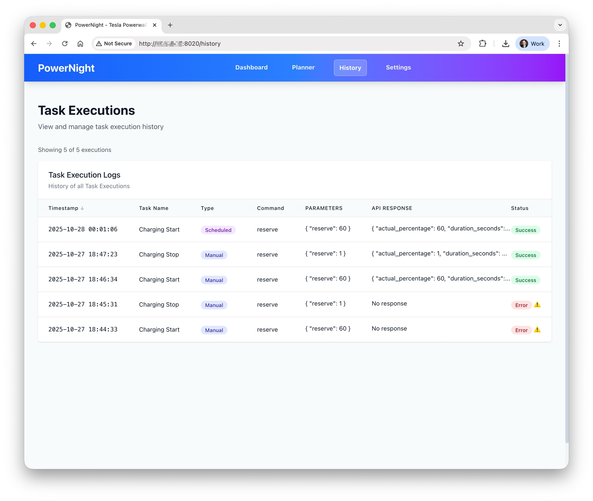
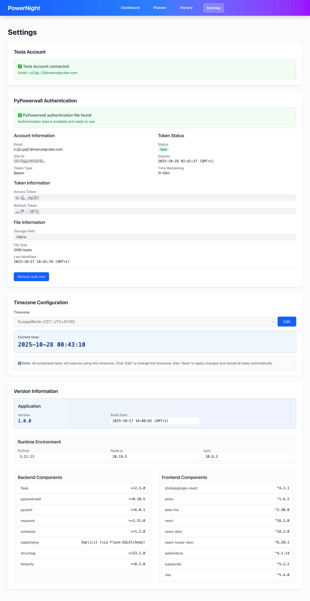

# PowerNight

**Automated off-peak grid charging for your Tesla Powerwall.**

PowerNight is a lightweight Docker-based application with a web interface that automates Tesla Powerwall backup reserve management. Schedule reserve percentage changes to optimize energy costs by charging from the grid during cheaper off-peak hours and discharging during expensive peak hours.

**My Personal Use Case**: Charge from grid overnight at low rates (in my case 0,16 EUR/kWh) and use the battery during peak hours (0,26 EUR/kWh).


## Table of Contents

- [Features](#features)
- [Usage](#usage)
- [Quick Start](#quick-start)
- [Installation](#installation)
  - [Docker Hub](#docker-hub-recommended)
  - [Synology NAS](#synology-nas)
- [Security](#security)
- [Build Process](#build-process)
- [FAQ & Links](#faq--links)


## Features

- 🔐 **Tesla Cloud Integration** - Secure cloud authentication via Tesla.com
- 🗓️ **Intelligent Scheduling** - Daily task execution at specified times with timezone support
- 📊 **Real-time Dashboard** - Live Powerwall status, battery level, power flow visualization
- 🌍 **Multi-Site Support** - Manage multiple Powerwall installations (experimental)
- 🐳 **Docker-First Design** - Multi-stage builds, non-root user, security hardening
- 🏗️ **Multi-Architecture** - Supports AMD64, ARM64, ARM/v7 (Raspberry Pi compatible)
- 💾 **Persistent Storage** - SQLite database with Docker volume mounting
- 🔄 **Auto-Recovery** - Circuit breaker pattern, exponential backoff, health monitoring
- 📱 **Modern Web UI** - React SPA with responsive design
- 📜 **Structured Logging** - JSON logs with component filtering and real-time updates


## Usage

Access the web interface at http://ip-address:8020 or [http://localhost:8020](http://localhost:8020).

### Dashboard

**Powerwall status with battery level, power flow, and system information**



- **System Information**: Site name, ID, operating mode, battery level
- **Power Data**: Real-time grid, home, battery, solar power readings
- **Grid Settings**: Backup reserve percentage, grid charging status, export mode
- **Last Updated**: Timestamp of latest data fetch

---

### Planner

**Task management UI for scheduling backup reserve changes**



- **Task Management**: Create, edit, delete scheduled tasks
- **Manual Execution**: Test tasks immediately
- **Execution Tracking**: View last execution time and status

---

### History

**Execution logs with timestamps and task results**



- **Structured Logging**: JSON-formatted logs with filtering
- **Real-time Updates**: Auto-refresh for live monitoring

---

### Settings

**Tesla Account configuration, site selection, and timezone settings**



- **Tesla Cloud Configuration**: Authorize and manage Tesla Access
- **Site Selection**: Switch between multiple Powerwall installations
- **Timezone Configuration**: Set scheduling timezone
- **System Information**: Version, build date, runtime environment


---

### CLI Commands

PowerNight CLI commands

```bash
# Get Powerwall status
powernight status
```


## Quick Start

1. **Install & Run PowerNight Docker Container**
   ```bash
   docker run -d \
     --name PowerNight \
     -p 8020:8020 \
     -v ./PowerNight-Data:/data \
     zaaicom/powernight:latest
   ```

2. **Open web interface**
   Navigate to [http://localhost:8020](http://localhost:8020) in your browser

3. **Set your Timezone under Settings**
   Navigate to Settings → Configure your local timezone

4. **Authenticate with your Tesla account on the Settings page**
   Click "Authorize with Tesla" and complete OAuth flow

5. **Check Powerwall data on the Dashboard and compare with the Tesla Mobile App**
   Verify battery level, power flow, and operating mode match

6. **Create your tasks under Planner**
   Navigate to Planner → Add tasks with time and reserve percentage

7. **Start a manual task execution**
   Test a task immediately to verify connectivity

8. **Verify successful execution on the History page**
   Check execution logs for success/error status


## Installation

### Docker Hub (Recommended)

Docker Hub is recommended for most users, especially Synology NAS deployments.

```bash
# Run with volume mount (IMPORTANT for data persistence)
docker run -d \
  --name PowerNight \
  -p 8020:8020 \
  -v ./PowerNight-Data:/data \
  zaaicom/powernight:latest
```

**⚠️ IMPORTANT**: Always use volume mounts (`-v ./PowerNight-Data:/data`) to persist OAuth tokens, database, and configuration. Without volumes, data is lost after container restart.

### GitHub CR (Container Registry)

Alternative registry hosted on GitHub Packages.

```bash
# Pull from GHCR
docker pull ghcr.io/zaai-com/powernight:latest

# Run with volume mount
docker run -d \
  --name PowerNight \
  -p 8020:8020 \
  -v ./PowerNight-Data:/data \
  ghcr.io/zaai-com/powernight:latest
```

### Docker Compose

**Recommended for production deployments** - ensures persistent volumes are always configured.

1. Download `docker-compose.yml` file

2. Start the application:

```bash
docker-compose up -d
```

### Synology NAS

Optimized for Synology DSM Docker integration:

1. **Install Synology Container Manager** from Package Center

2. **Create Folder** `/docker/PowerNight-Data` via File Station and add Read&Write permission to 'SYSTEM' user

3. **Pull image** from Docker Hub **via Synology DSM UI**: Go to Registry tab → Search for `zaaicom/powernight` → Download `latest` tag

4. **Create container** with:
   - **Port Settings**: Local Port 8020 → Container Port 8020
   - **Volume**: `/docker/PowerNight-Data` → `/data`
   - **Auto-restart**: Enable

5. **Access** via `http://synology-ip:8020`

6. **Additional Synology Notes**
    - Docker Hub recommended (native DSM UI integration)
    - GHCR requires manual pull via SSH
    - Use Synology Task Scheduler for automatic updates
    - Consider DSM Firewall rules for access control

### Local Development

For contributors and developers:

```bash
# Clone repository
git clone https://github.com/ZAAI-com/PowerNight.git
cd PowerNight

# Install Python dependencies
pip install -e ".[dev]"

# Install Node.js dependencies
npm install

# Build frontend (with version metadata)
./build.sh --no-docker

# Run application
python -m powernight.main
```

Access at [http://localhost:8020](http://localhost:8020)


## Security

### Local Access Only

**PowerNight is designed for trusted local networks only**

- 🏠 **Local Network Only**: Deploy within your home/private network behind a firewall
- 🔓 **Web UI Access**: The web interface is **NOT password protected**
- ❌ **Do NOT expose to internet**: Never expose port 8020 directly to the public internet
- 🔐 **Network Security Required**: Use firewall rules, VPN, or reverse proxy for access control

> **Warning**: Exposing PowerNight to the internet without additional security could allow unauthorized control of your Tesla Powerwall.

For detailed security guidance, see [SECURITY.md](SECURITY.md).

### Data Persistence

**⚠️ CRITICAL: Always use volume mounts for production deployment!**

**Why Volumes Are Critical:**
- `docker run` WITHOUT `-v` → **Data lost on container restart**
- Tokens stored in `/data` → **Re-authentication required**
- SQLite database in `/data` → **All schedules lost**

**Data Backup:**

```bash
# Backup entire data directory
tar -czf powernight-backup-$(date +%Y%m%d).tar.gz PowerNight-Data/

# Restore from backup
tar -xzf powernight-backup-20251022.tar.gz
```


## Build Process

**⚠️ IMPORTANT: Always use the build script for production builds!**

```bash
# Complete build with Docker image
./build.sh

# Build without Docker (faster for development)
./build.sh --no-docker

# Frontend only (version info won't update - NOT RECOMMENDED)
npm run build
```

**Build Script Features:**
- Generates fresh build timestamp (UTC)
- Creates `version-info.json` with build metadata
- Copies version info to `dist/` for web access
- Builds frontend with Vite
- Optionally builds Docker image with OCI labels


## FAQ & Links

For troubleshooting common issues, debugging, and log analysis, see [FAQ.md](FAQ.md).

### License

- MIT License - Copyright (c) 2025 Manuel Gruber
- See [LICENSE.md](../LICENSE.md) for full license text.

### Acknowledgments

- **PyPowerwall**: [jasonacox/pypowerwall](https://github.com/jasonacox/pypowerwall) - Tesla Powerwall API library
- **Flask**: Web framework for Python
- **React**: Frontend library
- **Vite**: Frontend build tool
- **Tailwind CSS**: Utility-first CSS framework

---

**Made with ⚡ by Manuel**

**GitHub**: [ZAAI-com/PowerNight](https://github.com/ZAAI-com/PowerNight) | **Docker Hub**: [zaaicom/powernight](https://hub.docker.com/r/zaaicom/powernight) | **GHCR**: [ghcr.io/zaai-com/powernight](https://github.com/ZAAI-com/PowerNight/pkgs/container/powernight)
